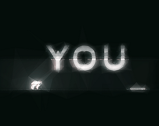

# YOU - A Mind-Bending Puzzle Platformer

  

Harness the power of time travel to solve intricate, challenging puzzles!

## Features

* **Manipulate Time:** Travel short durations into the future to overcome obstacles and interact with your past self.
* **Mind-bending Challenges:**  Put your puzzle-solving skills to the test in uniquely crafted levels.
* **Intuitive Controls:** Play with a joystick or keyboard – your choice!
* **Developer Mode:** Press F3 for more info and shortcuts to skip levels during testing.

## Controls

**Joystick**
* Left Joystick: Movement
* A Button: Jump
* B Button: Time Travel

**Keyboard**
* A/D Keys: Movement
* Spacebar: Jump
* F Key: Time Travel

**Important Note:** Each time travel turn has a limited duration.

- Time Leap: Press F (keyboard) or B (controller) to jump 4 seconds ahead. Act, then return to the present, 8 seconds in the past, and watch your past self mimic your future moves, shaping real-time puzzle solving.

## Play YOU here!

* [[Link to Play/Download](https://00sidd00.itch.io/you)]
